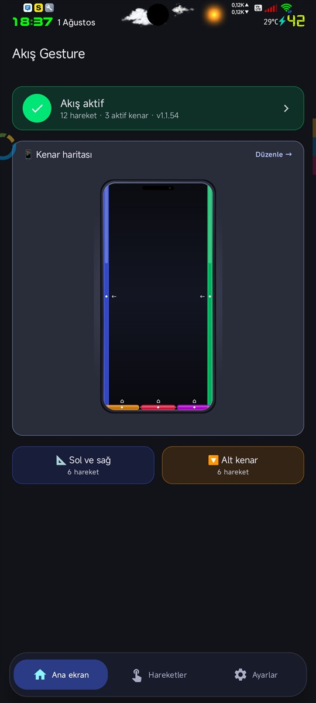
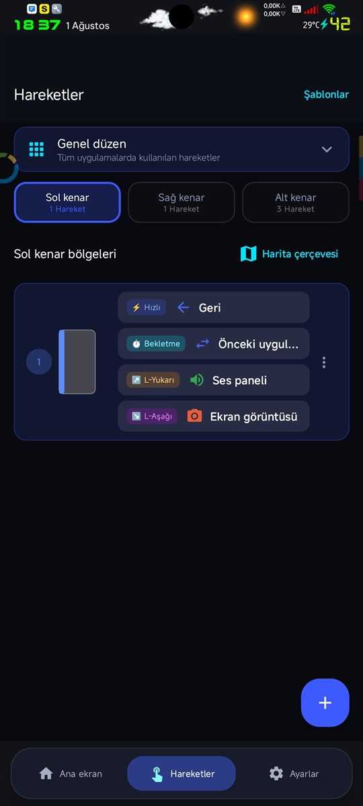
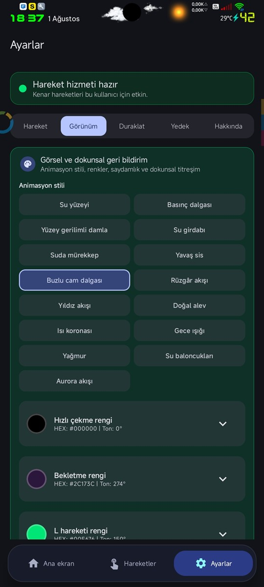
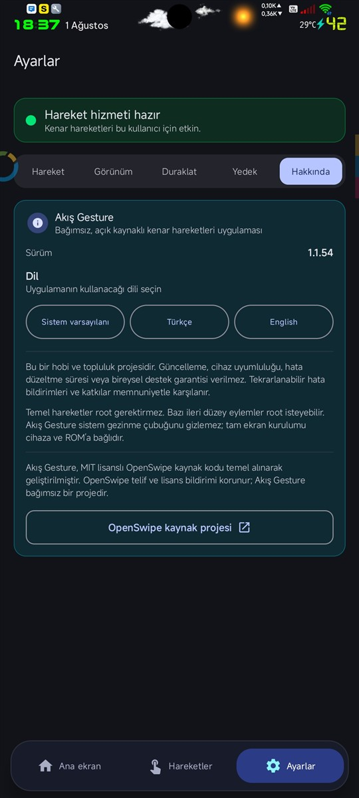
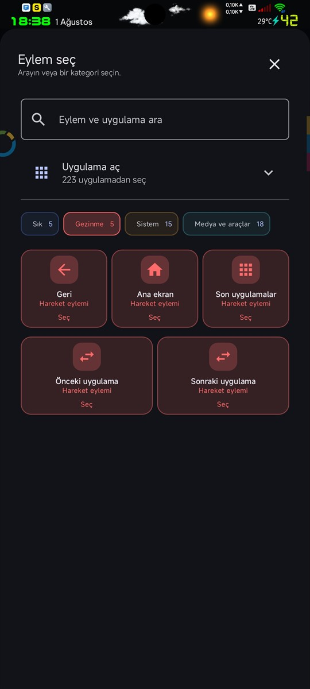
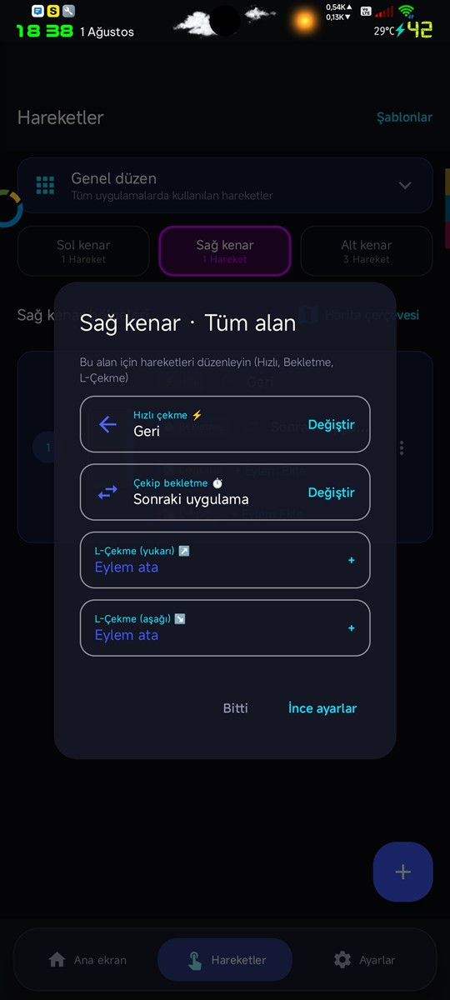

# Akış Gesture

**Türkçe** | [English](README-en.md)

Akış Gesture, Android ve özellikle HyperOS cihazlarda doğal kenar hareketleri
sunmak için geliştirilen kişisel, açık kaynaklı bir navigasyon uygulamasıdır.

Proje, MIT lisanslı
[OpenSwipe](https://github.com/ARCJ137442/OpenSwipe) tabanından başlamıştır.
OpenSwipe telif ve lisans bildirimi `LICENSE` dosyasında korunur.
Akış Gesture'ın Android paket kimliği `io.github.omeryol.akisgesture` olarak
özgündür; OpenSwipe atfı paket adında değil, lisans ve kaynak proje kayıtlarında
korunur.

## Sürüm v1.3.2 Öne Çıkan Özellikler

- **🔒 Son Kullanılanlar Koruması**: "Tümünü Kapat" butonunun uygulamayı kapatmasını önleyen gizleme anahtarı ve Recents Kilit 🔒 rehber kartı eklendi.
- **🔑 Şeffaf Root Rehberi**: Root'un bu uygulamada zorunlu olmadığını, yalnızca zorla kapatma ve özel shell komutu için kullanıldığını açıklayan bilgi kartı eklendi (sayfanın en altında).
- **📖 GitHub Deposu Bağlantısı**: Hakkında bölümüne Akış Gesture GitHub deposuna doğrudan erişim butonu eklendi.
- **🕰️ Sürüm Geçmişi Dialogu**: Geçmiş sürümlerdeki yenilikleri listeleyen uygulama içi sürüm geçmişi diyaloğu eklendi.


## Dil desteği

Uygulama arayüzü Türkçe ve İngilizce olarak eksiksiz yerelleştirilmiştir. Dil,
`Ayarlar > Hakkında > Dil` bölümünden `Sistem varsayılanı`, `Türkçe` veya
`English` olarak seçilebilir. Yeni diller Android kaynak yapısıyla eklenir:
varsayılan İngilizce metinler `res/values/strings.xml`, Türkçe metinler
`res/values-tr/strings.xml`, desteklenen diller ise `res/xml/locales_config.xml`
dosyasındadır. Kaynak anahtarı eşitliği birim testiyle denetlenir.

## Ekran görüntüleri

Son cihaz ekranlarından seçilmiş örnekler:

<p align="center">
  
  
  
</p>
<p align="center">
  
  
  
</p>

## Açık kaynak ve izinler

Akış Gesture açık kaynaklı, kişisel ve hobi amaçlı bir projedir. Kaynak kodu
[GitHub deposunda](https://github.com/omeryol/AkisGesture) incelenebilir. Uygulama
olduğu haliyle sunulur; sürekli geliştirme, cihaz uyumluluğu veya bireysel teknik
destek garantisi verilmez.

İstenen Android izinlerinin amaçları:

- **Erişilebilirlik hizmeti:** Kenar hareketlerini algılamak, geri/ana ekran/son
  uygulamalar gibi sistem eylemlerini gerçekleştirmek ve seçilen hareketleri
  uygulamak için gereklidir. Bu hassas izin Android ayarlarından kullanıcı
  tarafından açıkça etkinleştirilir.
- **Titreşim:** Haptik hareket geri bildirimi için kullanılır.
- **Kamera:** Yalnızca seçilebilen fener eyleminin cihaz flaşını kontrol etmesi
  için bildirilir; uygulamanın fotoğraf veya video çekme özelliği yoktur.
- **Bildirim ve ön plan servisi:** Hareket hizmetinin çalıştığını göstermek ve
  Android'in arka plan kısıtlamaları altında hizmet durumunu korumak içindir.
- **Açılışta çalıştırma ve pil optimizasyonu istisnası:** Kullanıcı etkinleştirirse
  cihaz yeniden başladıktan sonra hizmeti sürdürebilmek ve üretici pil yönetiminin
  hareket hizmetini durdurma ihtimalini azaltmak içindir.

Kurallar ve uygulama ayarları `Ayarlar > Yedek` bölümünden JSON dosyasına
aktarılabilir. Bu yedeği güvenli bir yerde saklamak kullanıcının sorumluluğundadır;
otomatik bulut yedekleme veya veri kurtarma garantisi yoktur.

## Navigasyonu kilitlemeden önce

Sistem gezinme tuşlarını veya çubuğunu ayrıca devre dışı bırakmak, Akış Gesture
durduğunda ya da erişilebilirlik hizmeti kapanınca cihazı geçici olarak
kullanılamaz hale getirebilir. Bu işlem Akış Gesture tarafından yapılmaz ve
projenin sorumluluğunda değildir. Geri dönüş yolu hazır değilse navigasyonu
kilitlemeyin.

Denemeden önce:

- Kuralları ve ayarları JSON olarak dışa aktarın.
- ADB/USB hata ayıklamayı veya cihazınızın resmi geri dönüş yöntemini hazır
  tutun; mümkünse bilgisayar ve kabloyla erişimi önceden test edin.
- Önce sistem navigasyonunu açık bırakıp tek bir hareket kuralını test edin.
- Akış Gesture'ı kapatma, erişilebilirlik hizmetini devre dışı bırakma ve
  sistem navigasyonunu geri açma adımlarını cihazınıza göre önceden doğrulayın.

Akış Gesture durursa önce sistem navigasyonunu geri açın veya Android Ayarları
üzerinden erişilebilirlik hizmetini kapatın; ardından uygulamayı yeniden
başlatın ya da JSON yedeğini geri yükleyin. Cihaz üreticilerinin ve üçüncü
taraf root araçlarının geri alma komutları farklı olabilir. Kullanıcı, cihazını
geri yükleyememe riskini kabul etmeden bu değişiklikleri yapmamalıdır.

## Proje ve yayın modeli

Akış Gesture, OpenSwipe'a gönderilecek tek ve büyük bir çekme isteği olarak değil,
bağımsız bir açık kaynak projesi olarak geliştirilmektedir. Proje; paket kimliği,
arayüzü, hareket motoru, doğal geri bildirim modülleri ve isteğe bağlı root
eylemleri bakımından kaynak tabandan önemli ölçüde ayrılmıştır.

- Akış Gesture için bağımsız bir GitHub deposu kullanılacaktır.
- Bu depo `origin`, OpenSwipe ise kaynak geçmişini izlemek için salt okunur
  `upstream` olacaktır.
- OpenSwipe'a uygun olabilecek küçük ve genel düzeltmeler, gerekirse daha sonra
  ayrı ve sınırlı çekme istekleri olarak sunulabilir.
- OpenSwipe'ın MIT telif ve lisans bildirimi korunur; Akış Gesture katkıları da
  aynı MIT lisansı altında yayımlanır.
- APK dosyaları kaynak ağacına eklenmez; doğrulanmış yayın paketleri GitHub
  Releases bölümünde sürüm etiketi ve sürüm notlarıyla sunulur.

Kaynak kod [omeryol/AkisGesture](https://github.com/omeryol/AkisGesture)
deposunda yayımlanır. Doğrulanmış ve imzalı APK dosyaları yalnızca GitHub
Releases bölümünde sürüm etiketi ve SHA-256 özetiyle sunulur.

## Destek, katkı ve kullanım sınırları

Akış Gesture bağımsız bir hobi ve topluluk projesidir. Güncelleme sıklığı, cihaz
uyumluluğu, hata düzeltme süresi veya bireysel teknik destek garantisi verilmez.
Tekrarlanabilir hata bildirimleri, iyileştirme önerileri ve kod katkıları
memnuniyetle karşılanır.

Temel kenar hareketleri Android Accessibility Service ile root olmadan çalışır.
Root yalnızca açıkça işaretlenmiş ileri düzey veya deneysel eylemler için
isteğe bağlıdır ve cihaz, ROM, APatch/Magisk sürümü ile üretici kısıtlamalarına
göre farklı davranabilir.

Akış Gesture sistem gezinme çubuğunu gizlemez. Tam ekran kullanım için gereken
sistem değişiklikleri ve üçüncü taraf root çözümleri projenin parçası değildir;
kullanıcı kendi cihazına ve ROM'una uygun yöntemi araştırmalıdır.

## Hedef

- Sol, sağ ve alt kenarda gecikmesiz hareket algılama
- Hızlı çekme, çekip bekletme ve **L-şeklinde çekme** için bağımsız eylemler
- Geri, ana ekran, son uygulamalar ve kullanıcı eylemleri
- Uygulamaya ve ekran yönüne göre farklı profiller
- Kullanıcıyı teknik ayrıntılarla yormayan Türkçe ve İngilizce arayüz
- HyperOS tarafından durdurulduğunda güvenli toparlanma
- Root/APatch desteğini ana uygulamadan ayrılmış yardımcı katmanda tutma

Root ile öndeki uygulamayı kapatma eylemi yalnızca kişisel profili hedefler ve
kritik sistem uygulamalarını korur.

## 1.1.54 ile gelen davranışlar

- Hareket durumları **birincil → bekletme → yukarı/aşağı L** sırasını izler.
  Geri çekiş aynı sırayı tersine çevirerek ikinci eyleme, birincil eyleme ve
  ardından iptale döner.
- L hareketinde animasyon dönüş başlangıcında sabit kalır; renk ve eylem ikonu
  L ilerlemesiyle büyüyüp L rengine yaklaşır. İlk tamamlanan L yönü aynı dokunuş
  boyunca kilitlenir.
- Görsel geri bildirim 15 bağımsız doğal animasyon modülünden oluşur. Hızlı
  çekme, bekletme ve L renkleri ayrıdır; siyah dahil seçilen renkler korunur.
- Uygulamaya duyarlı renk, seçilen hızlı çekme rengini ezmek yerine uygulama
  simgesinin baskın rengiyle harmanlar.
- Dokunsal geri bildirim açılıp kapatılabilir. Şiddet sürgüsü bırakıldığında tek
  kez kaydedilir ve önizleme titreşimi üretir.
- Önceki/sonraki uygulama tek bir geçmiş oturumunda birbirinin tersidir. Root
  zorla kapatma hedef süreci ve yalnızca o uygulamanın Son Uygulamalar kartlarını
  temizleyip sonucu doğrular.

## Mimari İlkeler

1. Hareket motorunun tek bir doğruluk kaynağı vardır.
2. Root, normal Android yolları başarısız olduğunda kullanılan yardımcıdır.
3. Uygulama sistem uygulamasına dönüştürülmez.
4. Island ve diğer çalışma profilleri kendiliğinden hedeflenmez.
5. Sürekli süreç öldürme, görünür uygulama açma veya sık aralıklı sorgulama yapılmaz.
6. Her davranış değişikliği test ve CHANGELOG kaydıyla birlikte gelir.

## Mevcut Durum

Sol, sağ ve alt kenar hareketleri HyperOS/Android 15 cihazda çalışmaktadır.
Hızlı çekme, çekip bekletme ve **L-şeklinde çekme (L-Swipe)** aynı alanda bağımsız
eylemler çalıştırır.

### L-Swipe Çalışma Mantığı

L-hareketi kenardan içe doğru çekip ardından parmağı yukarı veya aşağı
bükerek gerçekleştirilir. Hareket tespiti 2 fazlıdır:

- **Faz 1 — İçeri Giriş:** `maxInwardPx ≥ threshold` olduğu anda `inwardArmed`
  kilitlenir ve dönüş noktası (`bendStartY`) kaydedilir. Bundan sonra yatay
  koordinat azalsa dahi hareket iptal edilmez.
- **Faz 2 — Dikey Dönüş:** `turnDy = event.rawY − bendStartY`
  - `turnDy ≤ −35 px` → `SWIPE_UP_L`
  - `turnDy ≥ +35 px` → `SWIPE_DOWN_L`

Kural eşleştirme, parmağın kalktığı son konuma değil, kenara **ilk temas ettiği**
`downY` koordinatından (`initialTouchCoord()`) hesaplanan bölgeye bakılarak yapılır.

Bekletme eylemi varsayılan olarak 280 ms'de hazır olur; eylem parmak bırakılınca
devreye girer. Parmak kenara geri götürülerek herhangi bir hareket iptal edilebilir.

Akış Gesture içindeyken geri hareketi uygulamanın kendi sayfalarında gezinir.
Telefon biçimli kural haritası alanları taşıma, boyutlandırma, birlikte eylem
atama ve hareketi canlı deneme olanağı sunar. `Çalışmayacağı yerler` menüsünden
kilit ekranı, klavye, yatay ekran ve uygulamaya özel duraklatma koşulları seçilebilir.
Hareketler ekranında kenarlar sekmelerle ayrılır; her alanın hızlı ve bekletme
eylemi aynı kompakt satırda düzenlenir. Eylem seçicisinden telefondaki başlatılabilir
uygulamalar ada göre aranabilir; atanan uygulama kendi simgesiyle gösterilir.

## Kaynak Ağacı

```
app/src/main/java/io/github/omeryol/akisgesture/
│
├── OpenSwipeApp.kt               # Application sınıfı, DataStore akışları, ayar yazma
│
├── action/
│   ├── ActionDispatcher.kt       # Modüler eylem dağıtıcısı (Domain handler'lara delege eder)
│   └── handler/                  # ⭐ Domain bazlı eylem işleyicileri
│       ├── HardwareAndAppHandler.kt  # Fener, uygulama başlatıcı, ekran yönü, tuş kodları
│       ├── MediaActionHandler.kt     # Medya oynatma, parça değiştirme ve ses
│       ├── NavigationActionHandler.kt # Geri, Ana Ekran, Son Uygulamalar, Uygulama Geçişi
│       └── SystemActionHandler.kt    # Ekran Kilidi, Ekran Görüntüsü, Güç Menüsü, Paneller
│
├── backup/
│   └── SettingsBackupManager.kt  # Kuralları ve ayarları JSON'a yedekle/geri yükle
│
├── feedback/
│   ├── ActionSymbols.kt          # Eylem → Standart Unicode simge eşlemesi
│   ├── AppSwitchFeedbackRenderer.kt  # Alt kenar yön kapsülü animasyonu
│   ├── BezierStretchRenderer.kt  # Bağımsız doğal animasyon modüllerinin orkestrasyonu
│   ├── animation/                # 15 ayrı su, doğa, ışık ve atmosfer modülü
│   ├── FeedbackStyle.kt          # Görsel stil sabitleri
│   ├── FeedbackView.kt           # Dokunmayı engellemez overlay View
│   └── HapticHelper.kt           # ⭐ Baştan yazılmış modüler haptik ve ses motoru
│
├── gesture/
│   ├── AppPausePolicy.kt         # Uygulama listesine göre duraklatma kararı
│   ├── BottomAppSwitchPolicy.kt  # Alt kenar yatay sürükleme → uygulama geçişi
│   ├── EdgeGestureDetector.kt    # ⭐ Dokunma durum makinesi (Alt modüllerle modülerleştirilmiş)
│   ├── GestureCancelPolicy.kt    # İptal eşiği ve histerezis
│   ├── GestureConfig.kt          # Tüm ayar alanları (per-edge API + compat alias)
│   ├── GestureEngine.kt          # Overlay oluşturma, config diff, orkestrasyon
│   ├── GestureThresholds.kt      # Damping ve eşik hesabı
│   ├── SystemPausePolicy.kt      # Kilit/klavye/yatay/tam ekran duraklatma
│   ├── detector/                 # ⭐ Modüler hareket algılayıcı alt bileşenler
│   │   ├── DirectionValidator.kt # Sürükleme yönü ve açı toleransı doğrulaması
│   │   └── LSwipeDetector.kt     # 2-Fazlı L-Swipe vektör fiziği ve durum takibi
│   └── model/
│       ├── GestureResult.kt      # EdgeSwipe / BottomHorizontalSwipe / Tap / Vertical
│       ├── SwipeDirection.kt     # LEFT / RIGHT / UP / DOWN
│       └── TouchState.kt         # downX, downY, prevX, prevY, downTime
│
├── model/
│   ├── ActionNode.kt             # Sealed class — tüm eylem türleri
│   ├── GestureRule.kt            # Kenar + bölge + hareket türü + eylem
│   └── TriggerNode.kt            # GestureType enum (QUICK_SWIPE, SWIPE_HOLD,
│                                 #   SWIPE_UP_L, SWIPE_DOWN_L)
│
├── navigation/
│   └── InternalNavigationBus.kt  # Ekranlar arası uygulama içi gezinme köprüsü
│
├── overlay/
│   ├── EdgeSensorView.kt         # Dokunma olaylarını alan saydam View
│   ├── OverlayManager.kt         # WindowManager üzerinde overlay yaşam döngüsü
│   └── OverlayWindowFactory.kt   # Kenar penceresi parametreleri
│
├── receiver/
│   └── GestureCommandReceiver.kt # Broadcast alıcı — START / STOP / TOGGLE / eylem
│
├── root/
│   └── RootCommandExecutor.kt    # Root/APatch komut çalıştırıcı
│
├── rule/
│   ├── AppRuleProfilesSerializer.kt  # Per-app profil JSON serileştirme
│   ├── CompiledRuleSet.kt        # Hızlı eşleştirme tablosu (edge × type × section)
│   ├── GestureRuleGraph.kt       # Kuralları compile et → CompiledRuleSet'e dönüştür
│   ├── Presets.kt                # 9 hazır hareket düzeni
│   ├── RuleProfileResolver.kt    # Öndeki uygulamaya göre aktif profili seç
│   ├── RuleSerializer.kt         # Kural JSON serileştirme
│   └── RuleValidator.kt          # Kural tutarlılık denetimi
│
├── service/
│   ├── AccessibilityControl.kt   # Root'la erişilebilirlik servis yönetimi
│   ├── AccessibilityHealthPolicy.kt  # HyperOS sağlık onarımı politikası
│   ├── BootReceiver.kt           # Açılışta servisi başlat
│   ├── GestureAccessibilityService.kt  # Erişilebilirlik hizmeti giriş noktası
│   ├── GestureCommandActivities.kt     # MacroDroid etkinlik hedefleri
│   ├── GestureTileService.kt     # Hızlı Ayarlar kutucuğu
│   ├── KeepAliveService.kt       # Ön plan koruma servisi
│   └── MacroDroidPlugin.kt       # Locale/Tasker uyumlu eklenti giriş noktası
│
└── ui/
    ├── MainActivity.kt           # NavHost, izin kontrolü
    ├── component/
    │   ├── ActionIcon.kt         # Eylem renk + simge bileşeni
    │   ├── ActionPickerDialog.kt # Aranabilir eylem seçici
    │   ├── AddRuleDialog.kt      # Kenar başına kural ekleme modali
    │   ├── AkisGlassCard.kt      # Cam efektli kart bileşeni
    │   ├── EdgeZoneVisual.kt     # Yarım telefon kenar görünümü
    │   ├── GestureMapCard.kt     # Canlı harita kartı (dene + düzenle)
    │   ├── GestureMapGeometry.kt # Harita geometri hesabı
    │   └── InteractivePhoneMap.kt  # Dokunulabilir telefon silüeti haritası
    ├── screen/
    │   ├── HomeScreen.kt         # Durum paneli, metrik kutucukları
    │   ├── PermissionGuideScreen.kt  # İzin rehberi ekranı
    │   ├── RuleDetailScreen.kt   # Kural ayrıntısı ve düzenleme
    │   ├── RuleListScreen.kt     # Kenar sekmeleri + kural kartları
    │   └── SettingsScreen.kt     # Hareket hissi, görünüm, duraklatma, yedek
    ├── theme/
    │   ├── Color.kt              # Akış renk paleti (per-edge API + compat alias)
    │   ├── Theme.kt              # Material3 tema tanımı
    │   └── Type.kt               # Tipografi ölçeği
    ├── util/
    │   ├── ActionCategories.kt   # Eylem kategori grupları
    │   ├── ActionSearch.kt       # Eylem arama mantığı
    │   ├── ActionVisuals.kt      # Eylem → AutoMirrored vektör simge eşlemesi
    │   └── RuleLabels.kt         # Kenar / hareket / bölge Türkçe etiketleri
    └── viewmodel/
        ├── HomeViewModel.kt      # Durum, kural yükleme, ayar yazma
        └── RuleConfigViewModel.kt  # Kural düzenleme durum yönetimi
```

## Derleme

Gereksinimler:

- JDK 21
- Android SDK 35

Windows:

```powershell
.\gradlew.bat assembleDebug
```

APK:

`app/build/outputs/apk/debug/app-debug.apk`

Kişisel profile kurulum:

```powershell
adb install --user 0 -r app\build\outputs\apk\debug\app-debug.apk
```

Genel `adb install -r` kullanılmaz; aktif bir Island iş profili varsa uygulamayı
o profile de kaydedebilir.

## Otomasyon İntentleri

Akış'ın kendi erişilebilirlik hizmetini başlatmak, durdurmak veya durumunu
değiştirmek için:

```text
io.github.omeryol.akisgesture.action.START
io.github.omeryol.akisgesture.action.STOP
io.github.omeryol.akisgesture.action.TOGGLE
```

Intentler yayın (`Broadcast`) olarak `io.github.omeryol.akisgesture` paketine gönderilir.
Bu komutlar diğer erişilebilirlik hizmetlerini değiştirmez. Root varsa Hızlı
Ayarlar'daki `Akış` kutucuğu da aynı güvenli denetleyiciyi kullanır.

MacroDroid içinde iki kolay yol vardır:

- `Eylemler > Uygulamalar > Eklenti > Akış Gesture` yolundan başlat, durdur
  veya durum değiştir seçilir.
- `Uygulamayı başlat > Etkinlik seç` bölümünde `Akış · Hareketleri başlat`,
  `Akış · Hareketleri durdur` ve `Akış · Durumu değiştir` ayrı görünür.

Ayarlar ekranındaki `YEDEK` bölümünden kurallar ve uygulama ayarları tek JSON
dosyasına kaydedilip geri yüklenebilir.

## Yol Haritası

Ayrıntılı işlev eşliği ve geliştirici çalışma notları yerel geliştirme belgelerinde tutulur.

- [x] Temel projeyi temiz biçimde derle
- [x] Akış kimliği, adı ve görsel sistemini ayır
- [x] Akıcı kenar animasyonu ve dokunsal eşik geri bildirimi ekle
- [x] Hızlı çekme ve çekip bekletme kural motoru için birim testleri ekle
- [ ] Gerçek cihazda kenar gecikmesi ve yanlış tetikleme ölçümü yap
- [x] Hızlı çekme ve çekip bekletmeyi tek durum makinesinde birleştir
- [x] **L-Şeklinde çekme (L-Swipe) 2-fazlı durum makinesiyle tam çalışır hale getirildi**
- [ ] Uygulamaya özel profilleri ekle (uygulamaya göre duraklatma tamamlandı)
- [x] Tüm kenarlarda ayarlanabilir alan konumu ve uzunluğu ekle
- [x] Animasyon rengi, saydamlığı ve kenara geri dönerek iptal davranışını ekle
- [x] Beş animasyon biçimi ve iki harekete ayrı simge seçimi ekle
- [x] Kuralları telefon üzerinde gösteren dokunulabilir hareket alanı haritası ekle
- [x] Harita üzerinde alan taşıma ve uçlarından boyutlandırma ekle
- [x] Haritada gerçek eşiklerle canlı hızlı çekme/bekletme denemesi ekle
- [x] HyperOS erişilebilirlik katmanı başlatma yarışını gider
- [x] Uygulama içi geri ve güvenilir önceki uygulama davranışını ekle
- [x] HyperOS sağlık durumunu olay tabanlı izle
- [x] Korunan paketleri gözeten ayrı root/APatch eylem katmanını ekle
- [x] FNG kalıntılarını Swift Backup yedeğine dokunmadan temizle
- [x] **Sıfır derleyici uyarısı — tüm deprecated alanlar per-edge API'ye geçirildi**
- [x] **Modüler mimari (Navigation, System, Media, Hardware handler'ları) & Baştan yazılmış Haptik motoru**
- [x] **Çift Renkli Renk Uzayı (Birincil Hızlı Çekme + İkincil Çekip Bekletme paleti)**
- [x] **Sabitlenen L-Swipe Görsel Geri Bildirimi (Bükülme noktasında sabitlenen Neon Yeşil kilitlenme)**

## Lisans

Projenin OpenSwipe kaynaklı bölümleri MIT lisansı altındadır. Yeni kodların
lisans durumu değiştirilmedikçe aynı lisans uygulanır. Ayrıntılar `LICENSE`
dosyasındadır.
